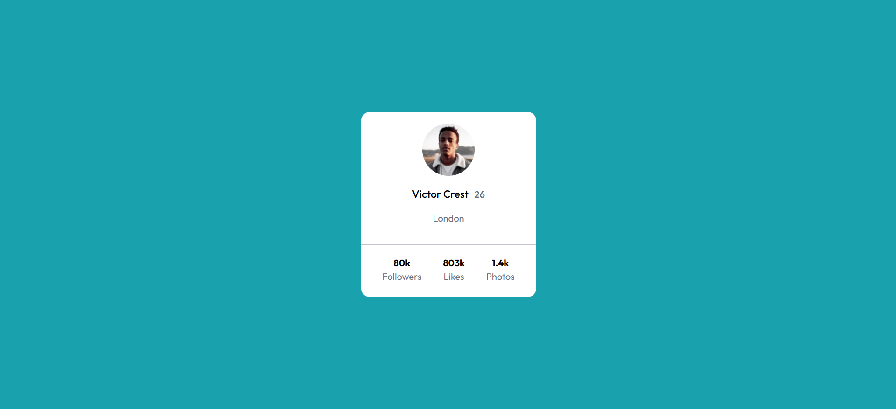
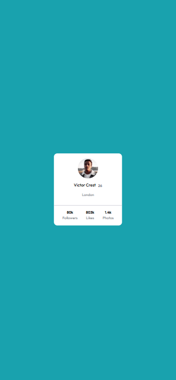

# Frontend Mentor - Profile Card Component | Minha Solução

Esta é a minha solução para o desafio **Profile Card Component** do Frontend Mentor. O objetivo é reproduzir o design fornecido utilizando HTML e CSS, seguindo boas práticas e garantindo responsividade.

---

## 📌 Índice
- [Visão Geral](#-visão-geral)
- [O Desafio](#-o-desafio)
- [Captura de Tela](#-captura-de-tela)
- [Links](#-links)
- [Meu Processo](#-meu-processo)
- [Tecnologias Utilizadas](#-tecnologias-utilizadas)
- [O que Aprendi](#-o-que-aprendi)
- [Próximos Passos](#-próximos-passos)
- [Recursos Úteis](#-recursos-úteis)
- [Autor](#-autor)
- [Agradecimentos](#-agradecimentos)

---

## 🌐 Visão Geral

### 🎯 O Desafio
Reproduzir o componente de cartão de perfil seguindo o design original, garantindo fidelidade visual e uma experiência responsiva.

---

## 🖼️ Captura de Tela

![Screenshot do projeto-descktop] ()
  
Exemplo:  
```md




Site Ao Vivo: (adicione aqui)

🛠️ Meu Processo
Tecnologias Utilizadas
HTML5 semântico

CSS3

Variáveis CSS

Flexbox

📚 O que Aprendi
Durante o desenvolvimento, aprimorei:

A organização de layouts utilizando Flexbox

Uso de variáveis CSS para manter um estilo padronizado

Criação de componentes simples e responsivos

Estruturação semântica de elementos HTML

Exemplo:

html
Copiar código
<section class="profile-card">
  
  <h1>Victor Crest <span>26</span></h1>
  <p>London</p>
</section>
css
Copiar código
.profile-card {
  background: var(--card-bg);
  border-radius: 15px;
  padding: 2rem;
  text-align: center;
  display: grid;
  gap: 1rem;
}

🚀 Próximos Passos
Evoluir ainda mais nos seguintes pontos:

Criar componentes mais modulares

Aprimorar microinterações e animações sutis

Melhorar escalabilidade do CSS

Praticar mais desafios focados em responsividade

📚 Recursos Úteis
MDN Web Docs: https://developer.mozilla.org

CSS Tricks: https://css-tricks.com

Frontend Mentor Community: inspiração e benchmarking

👤 Autor
Portfólio: Marcos Veiga

Frontend Mentor: @Marc0sVeiga

GitHub: @Marc0sVeiga

LinkedIn: www.linkedin.com/in/mari0-marc0s

🙌 Agradecimentos
Agradeço à comunidade do Frontend Mentor por compartilhar soluções e ideias que me inspiram a evoluir continuamente.

Ao chat-Gpt e Claude Ia e aos Mentores do curso DevQuest 2.0.